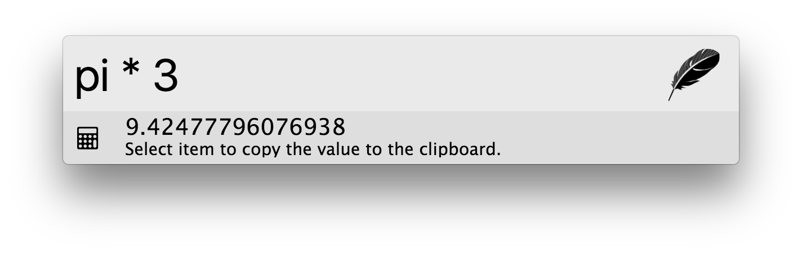

## Calculator

A basic calculator plugin written for zazu.

## Usage

Open Zazu and type in any math equation you can think of. Here are a few
examples:

* `13lb to oz`
* `pi * 3`
* `12 * 12`

If you click on the result it will copy the result to your clipboard.

## Installing

Add `tinytacoteam/zazu-calculator` inside of `plugins` block of your  `~/.zazurc.json` file.

~~~ json
{
  "plugins": [
    "tinytacoteam/zazu-calculator"
  ]
}
~~~

## Screenshots

